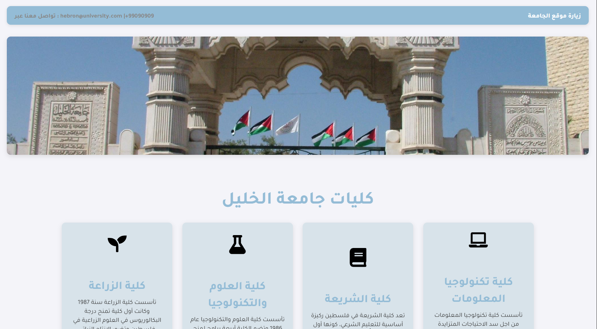
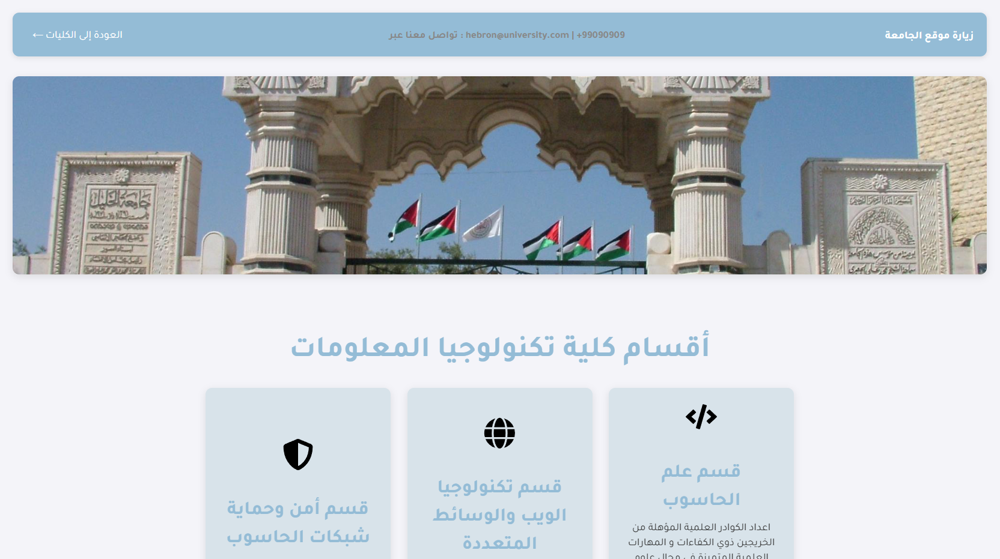
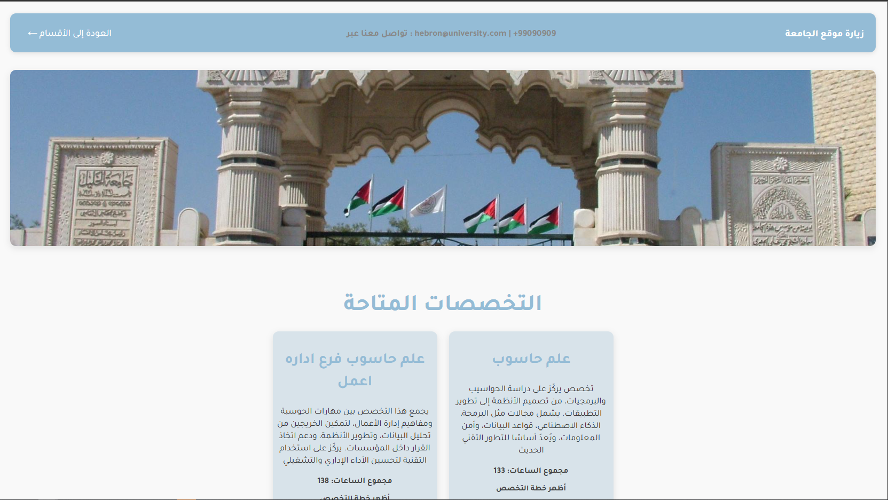
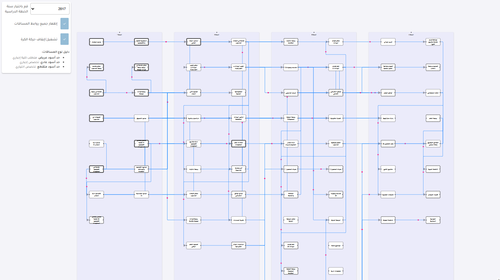
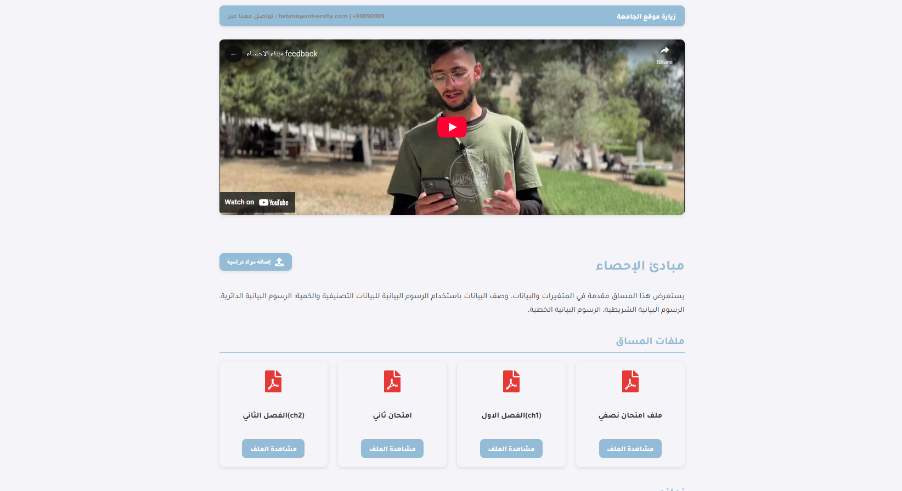
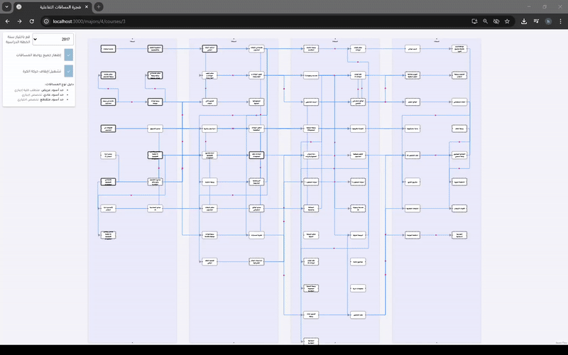

# 🎓 Interactive Course Tree (React + Directus)

This project is an interactive academic course tree system built with React and Directus. It allows students to visually explore their academic paths, understand course content, and make informed academic decisions using an intuitive and interactive interface.

---

## 🧾 Project Description

Students often face difficulties accessing comprehensive and accurate information about the courses in their academic programs. They struggle to understand the course content and find limited details about the topics covered in each course, which leads to poor decision-making that can negatively impact their academic goals.

To address this, we replaced the traditional paper-based course tree with an online, interactive system that provides visual aids, video explanations, and student feedback to help users better understand and navigate their academic paths.

---

## 🎯 Project Objectives

The Interactive Specialization Tree System aims to:

1. Build an interactive system that enables students to select appropriate courses independently using modern technology.
2. Provide a time-saving, user-friendly, and easily accessible course tree.
3. Help students from various faculties and majors improve their academic performance.
4. Offer a simplified way to explore available majors and courses by providing chapter content and past exams for each course.
5. Present reference videos from students who have previously taken the course, making it easier for others to understand the content and make informed decisions aligned with their academic goals.

---

## ✅ Project Benefits

This project offers several benefits, including:

1. Saving students time and effort in finding course information by providing it in a simple, interactive format. It also enables students to independently review course materials, encouraging self-reliance.
2. Providing complete information on required courses and academic prerequisites for each major, making it easier for students to understand their academic roadmap.
3. Enhancing students’ academic decision-making, reducing the chances of course withdrawal, and improving overall academic evaluation.

---

## 🛠️ Tech Stack

- **Frontend:** React.js, React Flow
- **Backend:** Directus (with MySQL)
- **Database:** MySQL
- **Other Tools:** Axios, REST API, Role-based policies

---

## 🚀 Features

- Interactive graph to visualize academic course paths and prerequisites
- Drag-and-drop functionality for easy editing (admin only)
- Upload and manage course materials (files or external links)
- View chapters and past exams for each course
- Watch videos from students who previously completed the course
- Role-based access via Directus permissions

---

## 📸 Screenshots

---

## 🎥 GIF Demo

